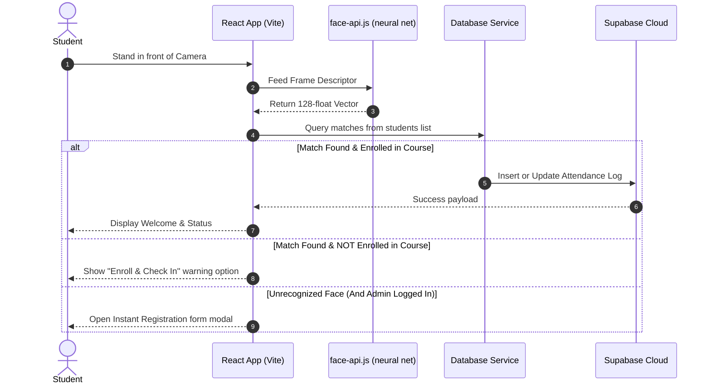

# Product Requirements Document (PRD) & Technical Specification
## Project: FaceAttend AI (Facial Attendance Recognition System)

This document outlines the product requirements, system architecture, database schema, user flows, and development roadmap for **FaceAttend AI**, a web-based biometric attendance tracking application.

---

## 1. Executive Summary & Vision

### 1.1 Product Vision
FaceAttend AI is a modern, web-based, zero-installation facial recognition attendance system. It enables schools, universities, and corporate offices to track daily attendance for multiple courses or events using standard webcams. By analyzing facial features directly in the client browser, it eliminates the need for expensive dedicated biometric hardware.

### 1.2 Core Value Proposition
- **Frictionless Experience**: Students stand in front of a screen to log attendance. No IDs, signatures, or badges required.
- **Biometric Security**: Prevents "proxy attendance" (buddy punching) by registering unique 128-dimensional facial vectors.
- **Real-time Synchronization**: Powered by a Supabase cloud database, updating administrative dashboards instantly.
- **Resilient Fallback**: Operates in local browser storage if the cloud database is disconnected, ensuring zero downtime.

---

## 2. User Roles & Permissions

| Role | Permissions & Capabilities | Access Point |
| :--- | :--- | :--- |
| **Scanner Feed** (Public Desk) | View camera scanner, look at camera to automatically log attendance, view recent successful scans. | `/` (Tab: Scanner) |
| **Student** (Self-Service) | Instant enrolment when an unregistered face is scanned (under administrative supervision). | `/` (Modal prompt during scan) |
| **Administrator** | Access configuration panel (school hours, grace periods, courses), register students manually, delete student records, view full logs, export reports to CSV. | `/` (Locked behind password) |

---

## 3. Functional Requirements & Features

### 3.1 Live Biometric Scanner (Scanner Tab)
- **Automatic Face Detection**: Captures webcam stream and uses neural networks to detect faces within a target guide box.
- **Biometric Matching**: Compares 128-dimensional face embedding vectors against the student database using a Euclidean distance match score.
- **Smart Cooldown Lockout**: Locks the scanner for 4 seconds after a success or error log to prevent duplicate scans of the same person.
- **Manual Scan Override**: Provides a button to force frame capture if auto-detect is delayed.

### 3.2 Dual-state Attendance Logging (Check-In & Check-Out)
- **Check-in Logic**: The first scan of the day logs a check-in.
  - **Present**: Scanned within the `start_time` plus `grace_period_mins`.
  - **Late**: Scanned after the `grace_period_mins` limit.
- **Check-out Logic**: The second scan of the day logs a check-out.
  - **Early Exit**: Checked out before the configured class `end_time`.
  - **Completed**: Checked out at or after the class `end_time`.

### 3.3 Dynamic Course Registration & Enrollment
- **Active Course Session Selector**: Admins select which course session is actively scanning.
- **Instant Enrollment Prompt**: If a recognized student scans but is *not* registered for the active course session, the system freezes scanning and presents an option to **"Enroll & Check In"** or **"Resume Scanning"**.
- **Biometric Registration**: If a face is unrecognized, and the administrator is logged in, the system launches an instant registration form, locking in the biometric face descriptor.

### 3.4 Administrative Console (Enroll & Dashboard Tabs)
- **Student Management**: Add students with name, email, courses, and biometric capture. Delete student profiles (cascades deletion to attendance records).
- **Time/Course Configurations**: Edit start time, exit time, grace period, and active courses.
- **Report Filtering**: Filter log tables by date, course, and attendance status.
- **Exporting**: Click to generate and download a clean CSV report of attendance.

---

## 4. Technical Architecture



### 4.1 Technologies Used
- **Frontend Framework**: React 18 (Vite)
- **Aesthetics & Styling**: CSS Custom Properties (Sleek dark mode, glassmorphism, responsive flex/grid)
- **Biometrics Processing**: `@vladmandic/face-api` (wrapper around TensorFlow.js using SsdMobilenetv1 face detection and FaceLandmark68 models)
- **Backend-as-a-Service**: Supabase (PostgreSQL, Auth, REST API)

### 4.2 Data Storage Model (PostgreSQL Schema)

#### Table: `public.class_settings`
Manages general configuration. Limited to a single row (`id = 1`) by database constraints.
```sql
CREATE TABLE public.class_settings (
    id integer PRIMARY KEY DEFAULT 1,
    start_time time without time zone DEFAULT '09:00:00'::time,
    end_time time without time zone DEFAULT '17:00:00'::time,
    grace_period_mins integer DEFAULT 15,
    courses text[] NOT NULL DEFAULT '{"General"}'::text[],
    updated_at timestamp with time zone DEFAULT timezone('utc'::text, now()),
    CONSTRAINT single_row CHECK (id = 1)
);
```

#### Table: `public.students`
Stores student records and their high-dimensional biometric vectors.
```sql
CREATE TABLE public.students (
    id text PRIMARY KEY, -- Student Registration Number (e.g. STU001)
    name text NOT NULL,
    email text NOT NULL,
    courses text[] NOT NULL DEFAULT '{}', -- Enrolled courses
    face_descriptor double precision[] NOT NULL, -- 128-float face embedding vector
    created_at timestamp with time zone DEFAULT timezone('utc'::text, now())
);
```

#### Table: `public.attendance`
Tracks daily check-ins and check-outs.
```sql
CREATE TABLE public.attendance (
    id uuid PRIMARY KEY DEFAULT gen_random_uuid(),
    student_id text REFERENCES public.students(id) ON DELETE CASCADE,
    date date DEFAULT CURRENT_DATE,
    check_in timestamp with time zone DEFAULT timezone('utc'::text, now()),
    check_out timestamp with time zone,
    status text NOT NULL, -- 'Present', 'Late', 'Early Exit', 'Completed'
    course text NOT NULL DEFAULT 'General',
    created_at timestamp with time zone DEFAULT timezone('utc'::text, now()),
    CONSTRAINT unique_student_day_course UNIQUE (student_id, date, course)
);
```

---

## 5. Non-Functional Requirements

### 5.1 Performance & Biometric Accuracy
- **Face API Detection Threshold**: Minimum SsdMobilenet confidence score set to `0.65` for auto-scanning to prevent false face detections.
- **Biometric Match Tolerance**: Euclidean distance distance threshold set to `0.55`. Lower scores indicate higher confidence matches.
- **Initial Load Time**: Under 3 seconds on standard connections (loads neural model files total size ~10MB directly from jsDelivr CDN caching).

### 5.2 Security & Data Privacy
- **Client-Side Processing**: Face detection and feature extraction occur entirely on the client's CPU/GPU. No video feed or photos are ever sent to the cloud database, protecting student privacy.
- **Biometric Vectors**: Only mathematical representations (128 floating-point numbers) of faces are stored in the database. These vectors cannot be reconstructed back into an image of a human face.

---

## 6. Future Product Roadmap

### Phase 1: Interactive Scanner Improvements (Completed ✅)
- Add database connection validation checks.
- Add instant enrollment prompt for recognized students not enrolled in active sessions.
- Fix white-on-white dropdown rendering.

### Phase 2: Administrative Enhancements (Upcoming 🚀)
- **Role-based Authentication**: Replace the single admin password with Supabase Auth users (Admin, Teacher, Student roles).
- **Multiple Camera Streams**: Support multi-terminal scanner configurations logging to a single central database.
- **Analytics Dashboard**: Add graphs and charts for course attendance statistics, average lateness, and absent reports.

### Phase 3: Notifications & Integration (Future 🔮)
- **Telegram/Slack Bots**: Send real-time notifications to instructors or parents when students check in late or fail to show.
- **School Management System Sync**: Export logs automatically to academic portals (Canvas, Moodle).
